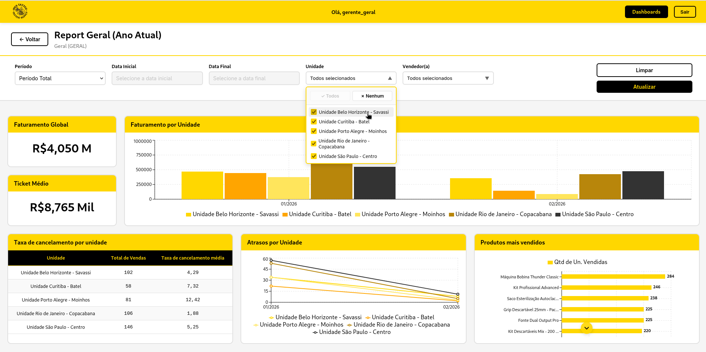
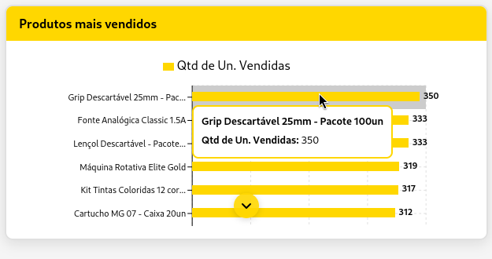
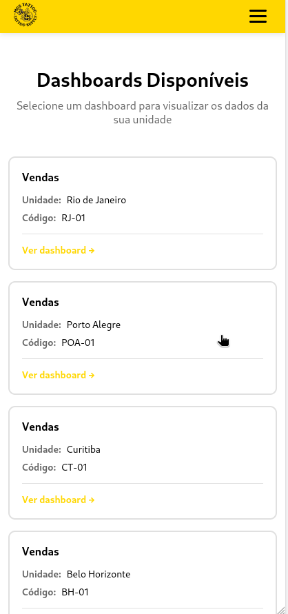
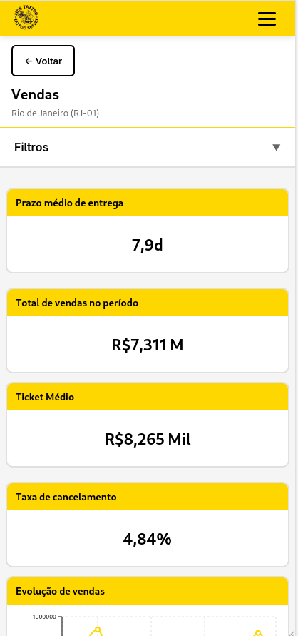
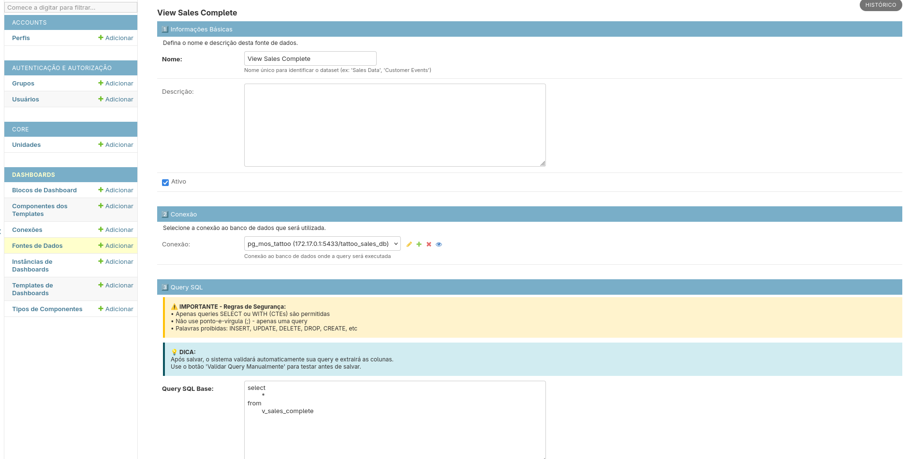
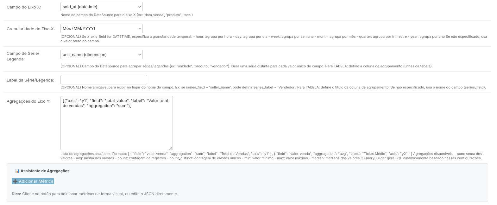
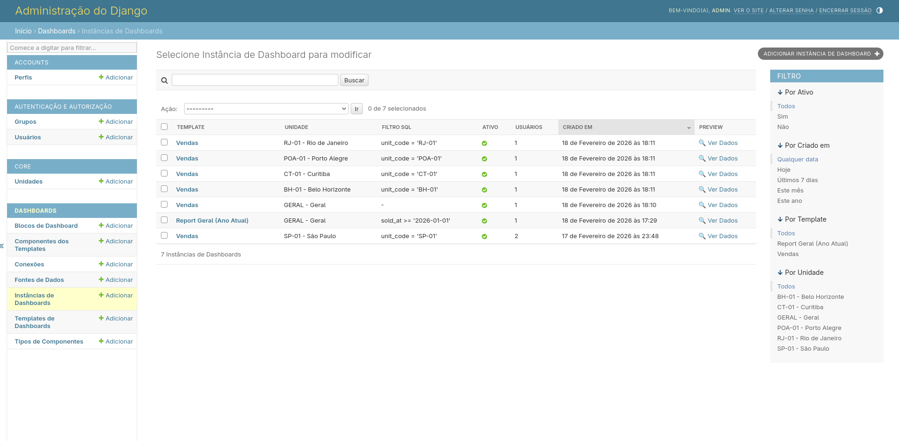
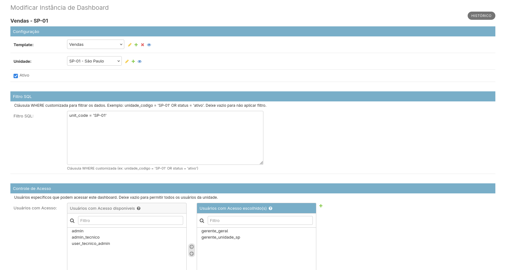

# Template Based BI Distribution | Estudo de Arquitetura Full Stack - Distribuição e Gerenciamento de Dashboards

> Exploração técnica sobre a distribuição escalável de painéis analíticos através de templates instanciáveis e permissionamento dinâmico.

## 🎯 O Problema em Foco

Equipes de dados frequentemente enfrentam o "caos da replicação": a necessidade de entregar o mesmo padrão de dashboard para dezenas de gerentes ou unidades diferentes, mudando apenas o filtro de dados. Manter 50 cópias do mesmo painel é insustentável.

## 🔬 A Proposta (PoC)

Este projeto é uma Prova de Conceito que valida uma arquitetura onde o dashboard é tratado como um **Template Genérico**. Através de uma camada de metadados no backend (Django), o sistema:

1. Instancia um template para uma unidade específica.
2. Injeta filtros de segurança via *Row Level Context*.
3. Renderiza dinamicamente no frontend sem redundância de código.

## 🏛️ Visão da Arquitetura

O ecossistema é dividido em módulos independentes para demonstrar a separação de responsabilidades:

- **[[Core Engine (Backend)]](https://github.com/Moscarde/mos_tattoo_backend)**: Gerenciamento de fontes de dados, construção de queries via interface e lógica de instanciação de templates.
- **[[Rendering Layer (Frontend)]](https://github.com/Moscarde/mos_tattoo_frontend)**: Uma interface agnóstica que interpreta JSON de metadados e constrói visualizações em tempo real.
- **[[Sample Implementation (MOS Tattoo)]](https://github.com/Moscarde/mos_tattoo_database)**: Uma implementação prática utilizando dados fictícios de uma cadeia de suprimentos para demonstrar a engine em funcionamento.

## 🚀 Diferenciais Explorados

- **Abstração de Dados**: O frontend não sabe o que está exibindo até receber as instruções do backend.
- **Escalabilidade de Manutenção**: Uma alteração no "Template de Vendas" propaga-se automaticamente para todas as N instâncias.
- **Segurança por Design**: O permissionamento é verificado antes do processamento da query, garantindo isolamento entre unidades.

## 📸 Galeria & Demonstração

### Frontend (Experiência do Usuário)

_A interface se adapta ao perfil do usuário (Gerente Geral vs Gerente de Unidade) e ao dispositivo._

**Dashboard Desktop**

**Mobile Responsivo**

  
   
  

### Backend (Configuração no Django Admin)

_Gerenciamento total via interface administrativa: conexões, templates e instancias._

**Configuração de Fontes e Templates**

**Gerenciamento de Instâncias**

